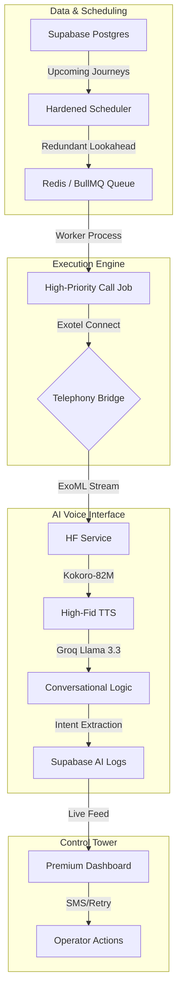

# 🚌 Boardly – Enterprise AI Fleet Dispatch

[](https://nodejs.org/)
[](https://exotel.com/)
[](https://groq.com/)
[](https://huggingface.co/hexgrad/Kokoro-82M)
[](https://supabase.com/)
[](https://bullmq.io/)

**Boardly** is a high-fidelity, L4 distributed AI voice notification system designed for modern mass transit. It marries a **premium cinematic frontend** with a robust, autonomous dispatch engine to automate passenger manifests, verify boarding status, and provide real-time conversational assistance.

---

## 🌟 High-Fidelity Capabilities

<div align="center">
  <table>
    <tr>
      <td width="50%">
        <h3>🤖 Autonomous Dispatch</h3>
        <p>Zero-touch journey scheduling. A hardened background scheduler triggers passenger calls in a 30-minute window before departure with redundant lookahead logic.</p>
      </td>
      <td width="50%">
        <h3>🗣️ Human-Grade Voice (Kokoro-82M)</h3>
        <p>Powered by <b>HF Kokoro-82M</b> and <b>Whisper-v3</b>, delivering ultra-lifelike, low-latency voice responses that sound remarkably human.</p>
      </td>
    </tr>
    <tr>
      <td width="50%">
        <h3>🛣️ Cinematic Operations</h3>
        <p>A "Luxury Monochrome" landing page featuring a high-contrast highway environment with parallax skyscrapers and residential landscapes for a premium operator experience.</p>
      </td>
      <td width="50%">
        <h3>📊 Manifest Observability</h3>
        <p>Advanced intent extraction (LATE, CANCEL, QUESTION) that automatically flags critical manifest updates for one-click operator resolution.</p>
      </td>
    </tr>
  </table>
</div>

---

## 🏗️ System Architecture



---

## 🛠️ Tech Stack

- **Primary Stack**: Node.js, Express, Redis
- **Task Orchestration**: BullMQ (Atomic Retries & Priority Queuing)
- **Database**: Supabase (PostgreSQL) with standardized Identity Schemas
- **Telephony**: Exotel (Primary) & Twilio (Legacy/SMS)
- **TTS/Inference**: Hugging Face (Kokoro-82M), Groq (Llama-3.3-70B), OpenAI Whisper
- **Aesthetics**: Vanilla CSS, Glassmorphism, Parallax Scenery Architecture

---

## 🚀 Quick Setup

### 1. Clone & Install
```bash
git clone https://github.com/jaggureddy11/ai-voice-calling-bot.git
cd ai-call-bot
npm install
```

### 2. Environment Configuration
Populate `.env` with your credentials. Ensure `BASE_URL` points to your public tunnel (e.g., ngrok).

```env
PORT=3000
BASE_URL=https://your-tunnel.ngrok-free.app
REDIS_HOST=127.0.0.1
REDIS_PORT=6379

EXOTEL_SID=...
EXOTEL_API_KEY=...
EXOTEL_API_TOKEN=...
EXOTEL_CALLER_ID=...

GROQ_API_KEY=...
HF_TOKEN=...  # Required for Kokoro-82M TTS

SUPABASE_URL=...
SUPABASE_KEY=...
```

### 3. Database & Seeding
Boardly uses a **String-Standardized ID Schema** to ensure cross-service compatibility. Run the following to seed your initial fleet:

```bash
# Trigger the internal seeding logic
curl -X POST http://localhost:3000/api/calls/seed
```

### 4. Continuous Development
```bash
# Launch both Backend & Cinematic Frontend
npm run dev:all
```

---

## 🎯 Strategic ROI

- **Operational Efficiency**: Eliminates manual calling overhead for fleet supervisors.
- **Improved Manifest Accuracy**: Real-time intent flagging allows for proactive seat re-allocation.
- **Premium Branding**: A cinematic UI and high-fidelity AI voice elevate the manifest management experience.
- **Audit Compliance**: Full session logs with duration tracking and sentiment analysis.

---

<div align="center">
  <p>Engineered for the future of autonomous logistics. <b>Boardly Core Team</b>.</p>
</div>
