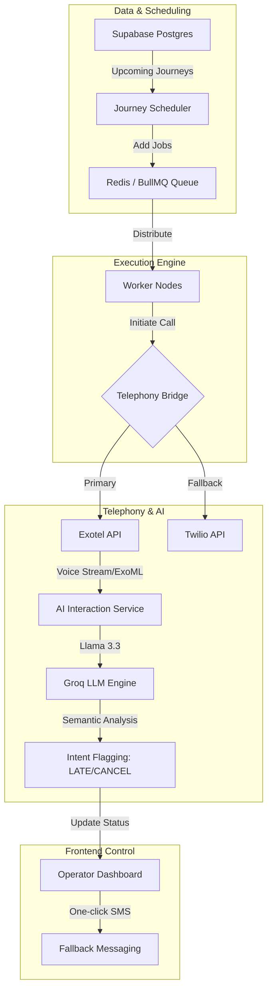

# 🚌 Boardly – Enterprise AI Fleet Dispatch

[](https://nodejs.org/)
[](https://exotel.com/)
[](https://groq.com/)
[](https://supabase.com/)
[](https://bullmq.io/)

**Boardly** (internally *BoardPing*) is a high-fidelity, L4 distributed AI voice notification system designed for modern mass transit architectures. It automates passenger dispatches, manifest verification, and real-time conversational assistance using ultra-low latency LLMs and localized telephony.

---

## 🌟 Premium Capabilities

<div align="center">
  <table>
    <tr>
      <td width="50%">
        <h3>🤖 Autonomous Dispatch</h3>
        <p>Zero-touch journey scheduling. Background workers trigger passenger calls exactly 30 minutes before departure based on live manifest data.</p>
      </td>
      <td width="50%">
        <h3>🗣️ Localized Conversational AI</h3>
        <p>Interactive voice flows with <1s latency. Native support for English, Hindi, Telugu, and Kannada via Groq's high-speed inference.</p>
      </td>
    </tr>
    <tr>
      <td width="50%">
        <h3>📊 Real-time Observability</h3>
        <p>Bento-style operator dashboard showing granular call states (Ringing, No-Answer, Busy) and semantic intent extraction.</p>
      </td>
      <td width="50%">
        <h3>⚖️ Enterprise Scaling</h3>
        <p>Built with BullMQ and Redis to handle thousands of concurrent calls with reliable retry logic and dead-letter queueing.</p>
      </td>
    </tr>
  </table>
</div>

---

## 🏗️ System Architecture



---

## 🛠️ Tech Stack & Integration

- **Runtime**: Node.js & Express
- **State Management**: Redis + BullMQ (Distributed Task Processing)
- **Database**: Supabase (PostgreSQL with Real-time Listeners)
- **Telephony**: Exotel (Indian Compliance) & Twilio
- **Intelligence**: Groq (Llama 3.3 70B) & OpenAI API
- **Frontend**: Vanilla JS with Glassmorphism, CSS Variables, and Chart.js

---

## 🚀 Quick Setup

### 1. Clone & Install
```bash
git clone https://github.com/jaggureddy11/ai-voice-calling-bot.git
cd ai-call-bot
npm install
```

### 2. Environment Configuration
Create a `.env` file from the template and fill in your credentials.

```env
# Server
PORT=3000
BASE_URL=https://your-tunnel.loca.lt

# Redis (Local or Cloud)
REDIS_HOST=127.0.0.1
REDIS_PORT=6379

# Telephony (Primary: Exotel)
EXOTEL_SID=...
EXOTEL_API_KEY=...
EXOTEL_API_TOKEN=...
EXOTEL_SUBDOMAIN=...
EXOTEL_CALLER_ID=...

# Telephony (Legacy: Twilio)
TWILIO_ACCOUNT_SID=...
TWILIO_AUTH_TOKEN=...

# AI Inference (Groq)
GROQ_API_KEY=gsk_...

# Database (Supabase)
SUPABASE_URL=...
SUPABASE_KEY=...
```

### 3. Database Migration
Ensure your Supabase tables (`journeys`, `passengers`, `call_logs`, `ai_logs`) are configured with the necessary extensions for intent flagging and attempt counts.

### 4. Launch
```bash
# Run backend and frontend monitoring concurrently
npm run dev:all
```

---

## 🎯 Impact & ROI

- **Zero Manual Calling**: Eliminates the need for bus operators or drivers to manually notify passengers.
- **Improved Manifest Clarity**: Automatically flags passengers who report being late, allowing operators to make sequence adjustments in real-time.
- **Multilingual Support**: Breaks communication barriers in diverse regions with native language voice bots.
- **Audit Ready**: Comprehensive logging of every call duration, status, and AI transcript for compliance and performance tuning.

---

<div align="center">
  <p>Built for the future of smart transit. Designed by <b>Boardly Engineering</b>.</p>
</div>
